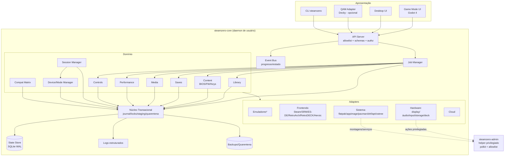

# COMPONENT-DIAGRAM

\* Emuladores = adapters manifest-driven; a lista v1 está no PRD §7.

## Notas

- Setas cheias = chamadas em processo; tracejadas = IPC com o helper privilegiado.
- O Event Bus entrega progresso/estado a todos os consumidores conectados; UI que morre e volta re-hidrata pelo State Store + replay de eventos do job.
- Backups/Quarentena são áreas de disco geridas exclusivamente pelo núcleo transacional (formato em 05-data/BACKUP-FORMAT.md).
