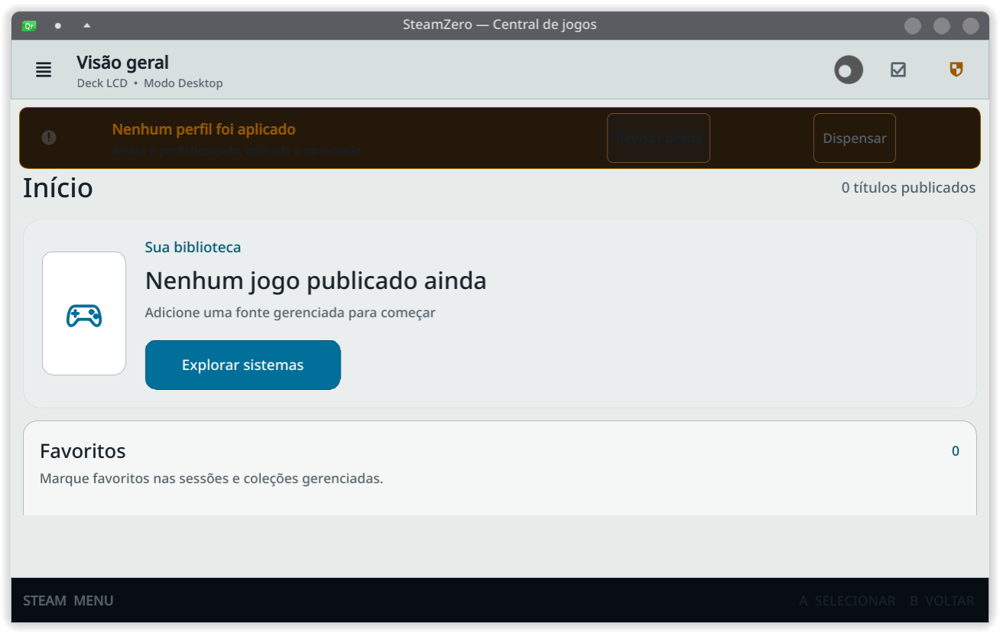

# Citron AppImage — observação física inicial

Data: 2026-08-17  
Release instalada: `0.1.0a46-fe360b3731d5`

## Resultado observado

No host real, Citron estava `installed` pelo executor `engine`, na origem
`appimage`, versão `2026.04.27-0237a9b88`. A verificação independente retornou
`verified=true` e `repairable=false`.

O lançamento governado retornou `started`, e o processo do payload permaneceu
ativo na verificação posterior. Uma segunda solicitação de instalação gerou
plano v3 `noop`; sua aplicação concluiu sem operação nova e a verificação final
continuou `installed` e `verified=true` na mesma versão. A inspeção de recovery
posterior não encontrou operação a recuperar; a autorização vazia de inspeção
foi aplicada pelo fluxo governado e terminou sem itens recuperados.

`02-central-instalada.png` é a superfície visível, sanitizada, da Central
SteamZero na release instalada durante a observação. Uma captura direta do
emulador foi descartada por conter conteúdo local fora do escopo; a evidência
persistida não contém tokens, credenciais, caminhos privados ou dados pessoais.

## Limite desta observação

Isto prova lançamento, verificação e idempotência de uma instalação já
existente. O ciclo completo de repair, falha controlada, rollback e uninstall
permanece pendente para Citron e não é inferido desta observação.
