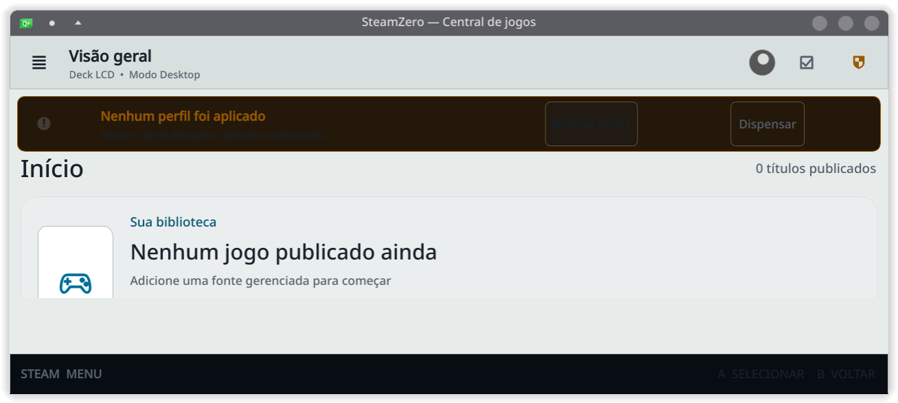

# Recuperação de convergência da release — 2026-08-17

## Entrega

- commit: `fe360b3731d5b3f72a2ec97ad0ad012e86abf46f`;
- release instalada: `0.1.0a46-fe360b3731d5`;
- rollback verificável: `0.1.0a46-a02dae5f60ac`;
- CI de push: run `32019392762`, verde nos oito jobs.

## Defeito e correção

O controlador aceitava o relatório de convergência mesmo quando a identidade do
daemon vinha aninhada em `daemon.identity`, deixando os campos de auditoria
vazios. A verificação pós-ativação falhava e o rollback podia deixar os units
inativos. A correção normaliza a identidade aninhada e recusa de forma explícita
qualquer relatório sem release e commit do daemon.

## Prova no host

O rollback governado restaurou a a46 e reativou socket e serviço. A atualização
governada seguinte instalou a candidata, convergiu sem restart adicional,
preservou o fingerprint de `state.db`, passou doctor, Game Mode e o smoke QML.
O journal terminal registrou `committed`, `deploymentHealthy=true` e
`physicalCertification=false`.

`01-release-instalada.png` foi capturado da janela real da UI da release
instalada. Mostra a tela inicial em modo Desktop, o estado vazio da biblioteca
e as ações visíveis para revisar ou dispensar o aviso de perfil. A captura não
contém tokens, credenciais ou caminhos privados.

## Resíduos conhecidos

O doctor continua informando um backup órfão já existente e a configuração de
boot como `unknown` por falta de permissão de inspeção; ambos são avisos sem
blocker e não foram modificados nesta recuperação.
